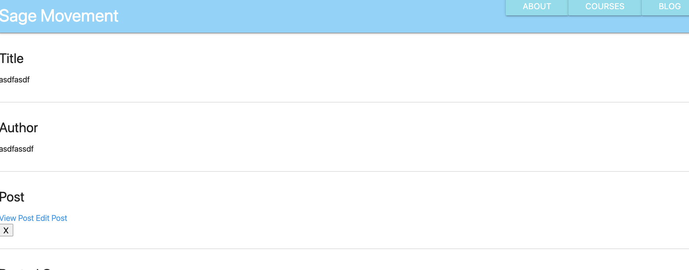

# sage-movement website

## Dev Tools
This game was created using HTML, CSS, and JavaScript, Express, Node.js, MongoDB, Mongoose, MongoDB Compass and Heroku.s

-----------------------------------------------------------------------------------------------
### Screenshots
-----------------------------------------------------------------------------------------------

Potential New Features & Dev Work
------------------------------------------------------------------------------------------------
- Build out update functionality.
- Add videos and courses content.
- Restrict edit/update/delete to user:admin.
- Add E-commerce potential.

[Check out the site here:](https://sage-movements.herokuapp.com/)

This project was written in VS Code.
 
